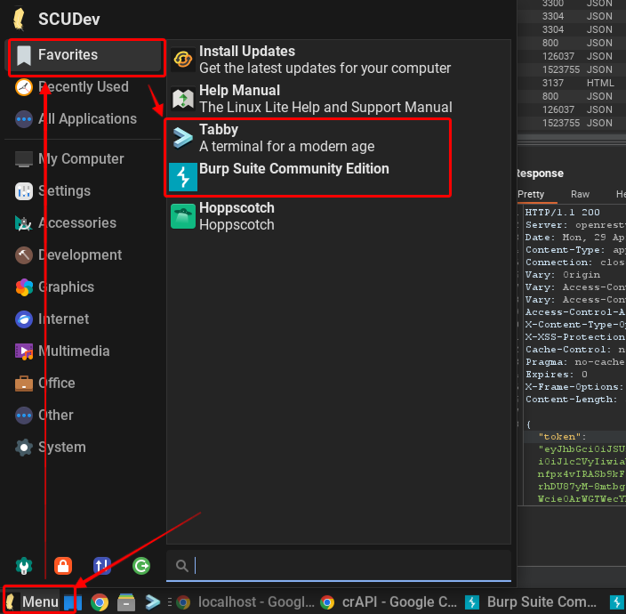

## Lesson 01 - Intro and Lab Setup

We will be using the **c**ompletely **r**idiculous **API** (crAPI) application stack for this training. crAPI is an intentionally vulnerable web application stack for learning about API security managed by OWASP.

- GitHub page: [OWASP/crAPI: completely ridiculous API (crAPI) (github.com)](https://github.com/OWASP/crAPI)
- Challenges: [crAPI/docs/challenges.md at develop · OWASP/crAPI (github.com)](https://github.com/OWASP/crAPI/blob/develop/docs/challenges.md)

  

In order to explore the crAPI vulnerabilities we will use Burpsuite Community Edition (Burp). You could also use Postman, Hopscotch or any other web proxy application that allows you to intercept and modify requests. Burpsuite is a tool commonly used by penetration testers and assessors because of its ability to decode hashes, modify JWT tokens, send requests repeatedly with small changes, fuzzing. It is extendable with plugins and the Pro version includes additional features including an automatic scanner to look for common vulnerabilities.

  

To speed up the process, we have created VirtualBox VM’s with crAPI and the tools you need pre-installed. The VM is based Lite Linux, a Debian based distribution designed to be small but easy to use. 

  

### Few things to get you started:

**Username:** _scudev_

**Password:** _scudev_

The user is part of the sudo group and can perform administrative tasks.

If your VM has access to the internet, it may attempt to update itself. You are welcome to do this but be warned it may take 5 to 10 minutes to complete so please get that started now before we get Lesson 03.

  

To access the tools, you will find shortcuts conveniently setup in the Favorites tab of the menu:  
  

- Burp Suite Community Edition (Burp) - This will be our primary tool for completing the crAPI challenges.
- Tabby - This is a user-friendly terminal application
- Hoppscotch - Opensource Postman like proxy application
- Postman - Proxy application that is not listed in the favorites menu but you can click on the menu and then type “Postman” to find it.

  

We will be “proxying” all of our traffic through Burp. When you start Burp, just create a temporary project and start it.

  

You can either use Firefox with the FoxyProxy extension to send traffic to 127.0.0.1:8080 or (my personal recommendation) use the built-in Burp browser that automatically proxy all traffic.

  

  

**NOTE:** Do not use Chrome with the FoxyProxy extension. Chrome has a built-in proxy bypass for all 127.0.0.1 (localhost) traffic and the crAPI application is setup on the localhost. Using Chrome will prevent traffic from showing up in Burp’s proxy history.

  

crAPI will have the following applications preinstalled:

- A microservice architecture, API driven, web application on port 8888/tcp. You can browse to it using localhost:8888
- Mailhog: A fake webmail application that receives all email from the application. Accessible on port 8025. You can browse to it using localhost:8025

  

### First Steps:

1. Startup Burp (ignore any application updates for now)
- Select temporary project in memory and then “next”.
- Select “Start Burp”
3. Start the Proxy browser
- Click on the menu tab “Proxy” and then on “Open browser”
- Browse to localhost:8888
5. Create an account so you can explore
- Select “SignUp”
- Fill in the form with any fake information you like. (note: all fields must be filled in).
- 
7. Login with the newly created account
8. Add a vehicle
- Select the “Click here” link in the banner.
- 
- Open a new tab and browse to Mailhog at localhost:8025
- Find the “Welcome to crAPI” email and open it to find your VIN and PIN. Take note as you will need these to add a vehicle.
- Now click on the “+ Add a Vehicle” link and fill out the form with the VIN and PIN provided in the email.
10. At this point, you should have an account with a vehicle like any other new user just getting started with the application.
- 
12. Look at your Proxy History
- Switch back to Burp Suite Community (ctrl-tab will switch between apps quickly).
- Click on the “HTTP history” tab.
- Click on the downward facing arrow next to the hashtag column to reverse sort by request ID.
- 
- Note that you will see requests made by your browser when it loads or interacts with the application.
14. Filter traffic to only what is in scope
- Click on the “Target” menu tab.
- Right click on the “http://loclhost:8888/” item
- Select “Add to scope”
- 
- Click back to the “Proxy” tab.
- Click on the Filter bar.
- Check the “Show only in-scope items”
- 
- Select “Apply”
16. You should only be seeing requests related to the crAPI application now.
- 
- Note: You may see colored lines indicating a JWT token was included with the request.

You are all set to start the challenges. Enjoy!!!

### Misc

The following is a list of API endpoints pulled from the Javascript files included with the application:

            LOGIN: "api/auth/login",
            GET_USER: "api/v2/user/dashboard",
            SIGNUP: "api/auth/signup",
            RESET_PASSWORD: "api/v2/user/reset-password",
            FORGOT_PASSWORD: "api/auth/forget-password",
            VERIFY_OTP: "api/auth/v3/check-otp",
            LOGIN_TOKEN: "api/auth/v4.0/user/login-with-token",
            ADD_VEHICLE: "api/v2/vehicle/add_vehicle",
            GET_VEHICLES: "api/v2/vehicle/vehicles",
            RESEND_MAIL: "api/v2/vehicle/resend_email",
            CHANGE_EMAIL: "api/v2/user/change-email",
            VERIFY_TOKEN: "api/v2/user/verify-email-token",
            UPLOAD_PROFILE_PIC: "api/v2/user/pictures",
            UPLOAD_VIDEO: "api/v2/user/videos",
            CHANGE_VIDEO_NAME: "api/v2/user/videos/<videoId>",
            REFRESH_LOCATION: "api/v2/vehicle/<carId>/location",
            CONVERT_VIDEO: "api/v2/user/videos/convert_video",
            CONTACT_MECHANIC: "api/merchant/contact_mechanic",
            RECEIVE_REPORT: "api/mechanic/receive_report",
            GET_MECHANICS: "api/mechanic",
            GET_PRODUCTS: "api/shop/products",
            GET_SERVICES: "api/mechanic/service_requests",
            BUY_PRODUCT: "api/shop/orders",
            GET_ORDERS: "api/shop/orders/all",
            GET_ORDER_BY_ID: "api/shop/orders/<orderId>",
            RETURN_ORDER: "api/shop/orders/return_order",
            APPLY_COUPON: "api/shop/apply_coupon",
            ADD_NEW_POST: "api/v2/community/posts",
            GET_POSTS: "api/v2/community/posts/recent",
            GET_POST_BY_ID: "api/v2/community/posts/<postId>",
            ADD_COMMENT: "api/v2/community/posts/<postId>/comment",
            VALIDATE_COUPON: "api/v2/coupon/validate-coupon"
