## Lesson 03 - API1:2023 Broken Object Level Authorization (BOLA)

"APIs tend to expose endpoints that handle object identifiers, creating a wide attack surface of Object Level Access Control issues. Object level authorization checks should be considered in every function that accesses a data source using an ID from the user."
[OWASP Top 10 API Security Risks – 2023 - OWASP API Security Top 10](https://owasp.org/API-Security/editions/2023/en/0x11-t10/)

Reference: [API1:2023 - Broken Object Level Authorization](https://owasp.org/API-Security/editions/2023/en/0xa1-broken-object-level-authorization/)

Broken authorization is extremely common and provides attacker's unauthorized access to information. The attacker can use this access to view and copy private data. In other cases, the data has been rendered unusable because the attacker has changed or deleted the information.

For APIs, Broken Authorization can occur at the Object level, the Properties level or the Functions level.

We are going to start with the Object level. Modern Object Oriented Programming (OOP) languages packages data properties and data actions into objects that are analogous to real world objects. Whenever the application makes a request for data, the object should check authorization before allowing the presentation of the data or actions to take place on the data.

**Please Note:** We will provide you detailed instructions for each of the steps. It will take a bit longer on these earlier labs as you get familiar with Burp Suite. But as you get more comfortable, we will provide a few less details and build off the labs and examples you will have completed. By the time you end this training, you will be very familiar with Burp Suite and the impact of common API vulnerabilities.

## Access another user's vehicle information

Attacker's often use a proxy system to track requests and responses as they browse through a site. Then they can go back and perform searches on the data to find things like:

* API endpoints
* Object Ids
* Large responses that contain more information than is required for the request.

In this case, we will browse to the Community page that contains a forum and the ability to add posts. In this case, the forum posts only require the following data:

* Title
* Author
* Date
* Content

But if we look at the response we will see:

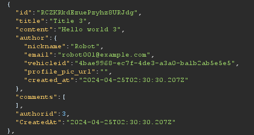

That is much more information than required. We also note special ids that may prove valuable when communicating to other API endpoints (e.g., authorid, vehicleid, etc.) Using this information, we continue browsing and observe a request that takes a vehicle id as a parameter. We will use one of the vehicle id's we observed in the forum to request information from the vehicle id and gain info on another user's vehicle.

#### Lab Steps

1. Open the Burp Suite browser.

2. Login to crAPI.

3. Browse to the "Community".

4. Switched back to Burp Suite and open the Proxy Http History tab.

   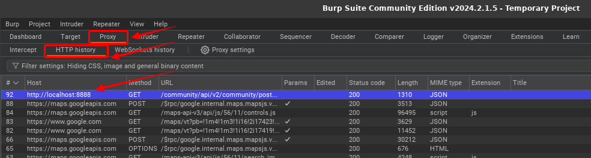

5. Click on the row that has the /community/api URL.

6. Scroll through the Response.

   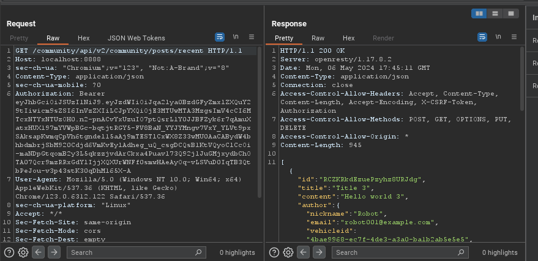

7. Notice that each forum post includes all the additional information.

8. Select one of the users and copy the vehicle id.

9. Switch back to the browser and browse back to the "Dashboard" and then click on the "Refresh Location" button.

   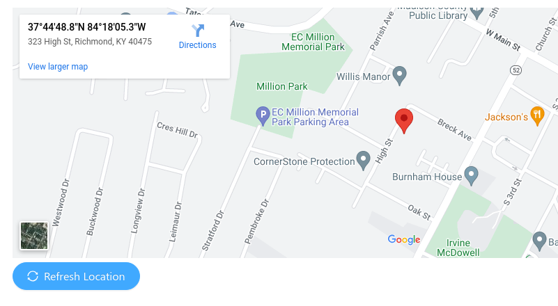

10. Switch back to Burp Suite Proxy HTTP History tab and you will see several API requests. In particular, there is a request to /identity/api/v2/vehicle/ with some long guid identifier. If you click on that row, you will see the response has data on the latitude and longitude for that vehicle. Let's take advantage of this to lookup another vehicle's location.

11. Right click on that row and select "Send to Repeater" or type Ctrl-R.

    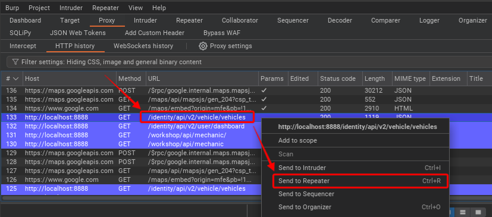

12. Repeater is a tool that allows us to manually tweak a request and then send it to the API to see what difference we get in the response. Click on the "Reapter" tab and you should see our request ready to tweak.

    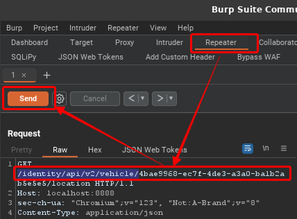

13. Now highlight the guid part of the GET request and paste in the guid of the other vehicle. Next select the "Send" button.

14. Note that you should see the sensitive information (e.g., longitude and latitude) in the response.

    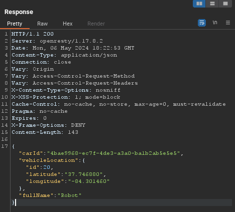

15. Challenge completed

## Access another user's mechanic reports

For this second challenge, we will attempt to access sensitive information in the way of past repair reports. We notice that there is a "Contact Mechanic" button on the dashboard page. By sending a request to the mechanic we notice in the response that the system sends a separate request to the API that has a report_id as a parameter. The report id appears to be just a simple integer so we attempt to use different integers to find additional reports.

#### Lab Steps

1. Picking up where we left off, from the "Dashboard" click on the "Contact Mechanic" button.

2. Select any mechanic and enter any description you like. Then click on "Send Service Request".

3. Now go to the Proxy HTTP History window and look for the POST request /workshop/app/merchant/contact_mechanic row.

4. Notice in the response windows the "report_link" parameter.

   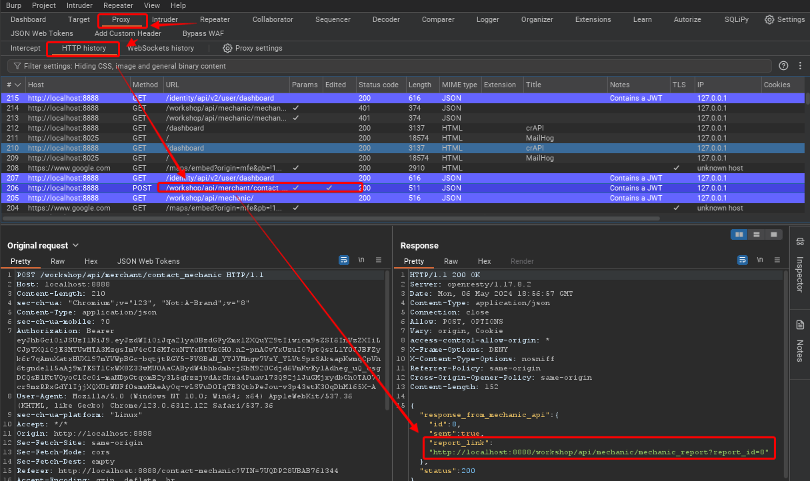

5. Let's attempt browse to that URL.

   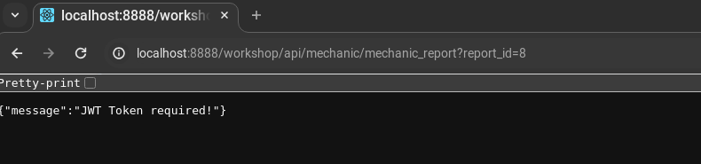

6. Let's build a request with the proper JWT and see if we can manually get to the report. Go back to the Proxy HTTP History window and look for the request you just made to /workshop/api/mechanic. Right click on it or use Ctrl-R and send it to repeater.

7. In the Proxy HTTP History window, click back on any of the rows that show they contain a JWT. Then in the request window, highlight the Authorization line and copy the whole line with the bearer token.

   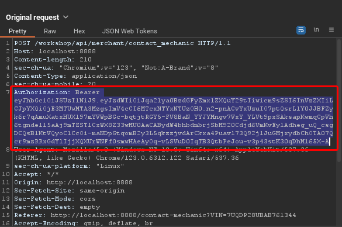

8. Click on the Repeater tab and you should see the request ready to be tweaked. Somewhere in the request header paste in the Authorization line and then select "Share".

   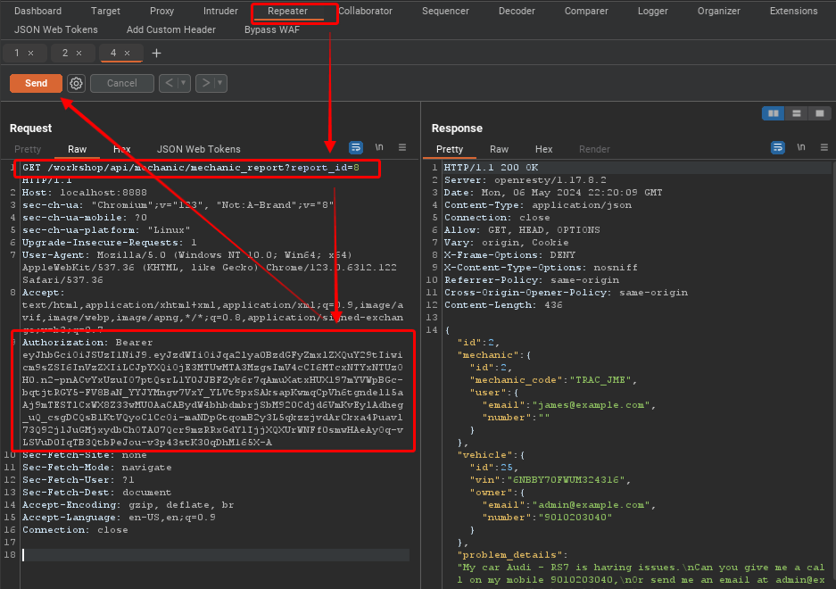

9. The response should show you your request. Now change the "report_id=8" to "report_id=2" and select the "Send" button.

10. You should see the mechanic report in the response window for another user's vehicle.

11. Challenge completed.
