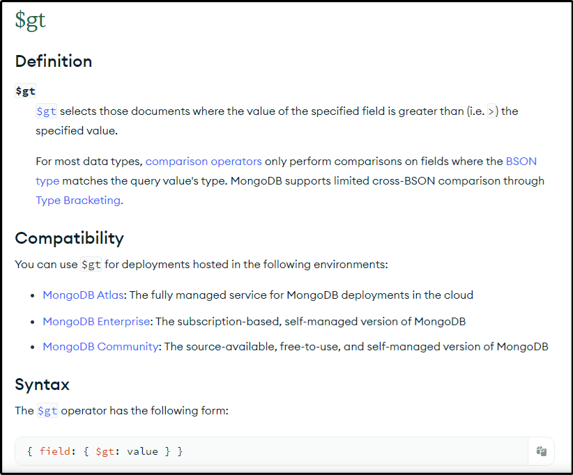
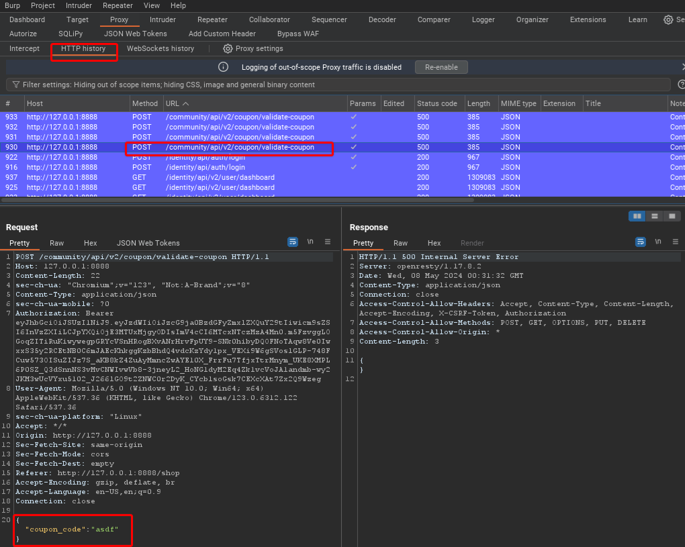
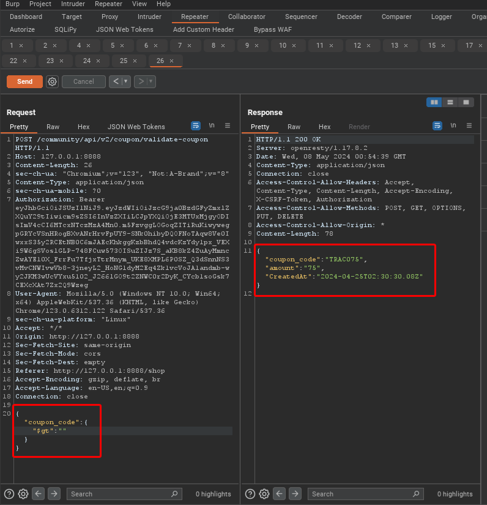

## Lesson 11 - Other1 NoSQL Injection

"NoSQL databases provide looser consistency restrictions than traditional SQL databases. By requiring fewer relational constraints and consistency checks, NoSQL databases often offer performance and scaling benefits. Yet these databases are still potentially vulnerable to injection attacks, even if they aren’t using the traditional SQL syntax. Because these NoSQL injection attacks may execute within a procedural language, rather than in the declarative SQL language, the potential impacts are greater than traditional SQL injection."
[WSTG - Latest | OWASP Foundation](https://owasp.org/www-project-web-security-testing-guide/latest/4-Web_Application_Security_Testing/07-Input_Validation_Testing/05.6-Testing_for_NoSQL_Injection)

NoSQL databases are especially popular with API developers. This is because they lend themselves well to storing application procedures as well as data. But this also means that if you can inject code into the database, it may result in commands that will be executed when retrieved from the database or executed at storage. Injections are less understood and less well known in NoSQL databases. This means that they are relatively more common than SQL injection vulnerabilities. While not part of the OWASP Top 10, they are very common and very damaging.

## Use a free coupon

We will use a NoSQL injection to trick the system into using our logic to find all codes that are "greater than" nothing (which would probably be every coupon in the database). 

MongoDB has a $gt operator to specify greater than as explained at their website here: https://www.mongodb.com/docs/manual/reference/operator/query/gt/

#### Lab Steps

1. Browse to the "Shop" menu to see products you can purchase. Take note of the amount of funds you have available.

2. Click on the "Add Coupon" button. Enter anything you like into the field and submit it for validation.

3. Go to the Proxy HTTP History and look for the POST request URL /community/api/v2/coupon/validate-coupon

   

4.  Right-click on the row and send it to Repeater. Then change the "coupon_code" parameter to be "{"$gt":""}" and then select "Send".

   

5. Notice that the response shows a coupon code for $75. Go back to your browser and see if you can validate the code. You will see your funds increase by $75.

6. Challenge completed.
