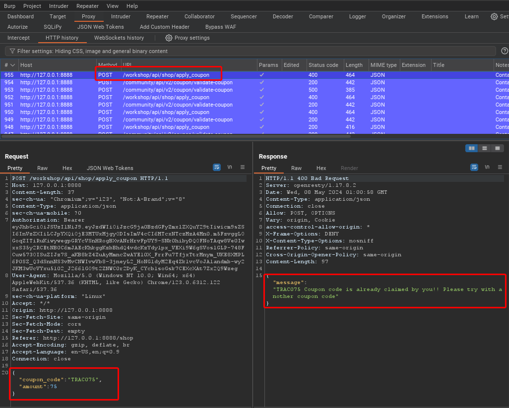
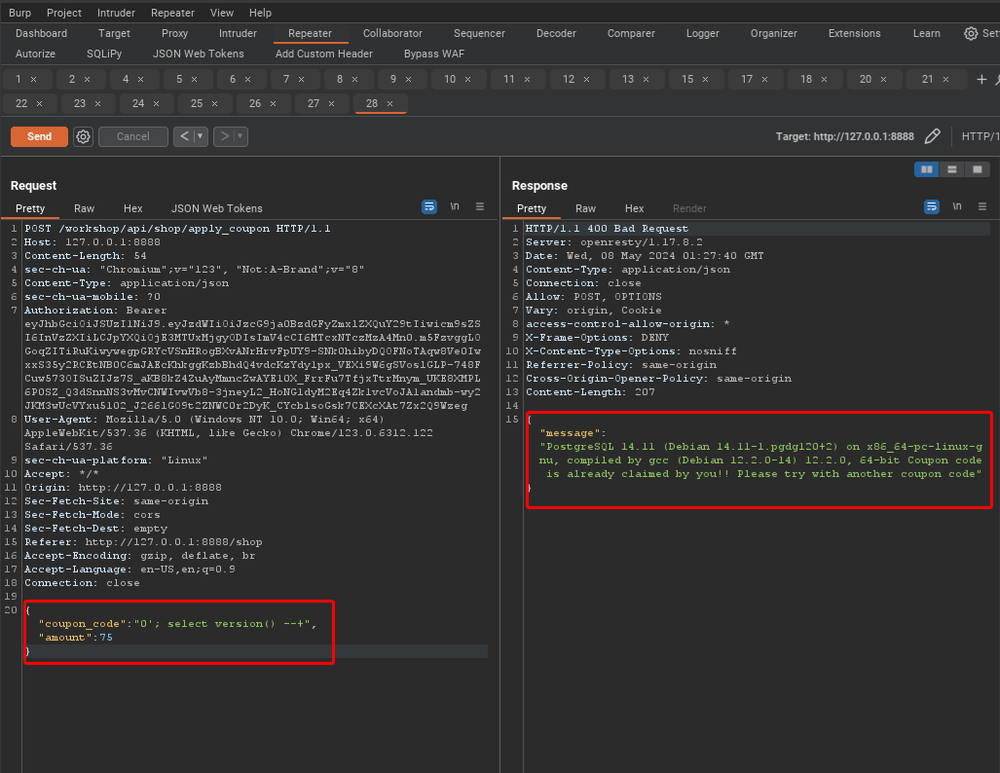
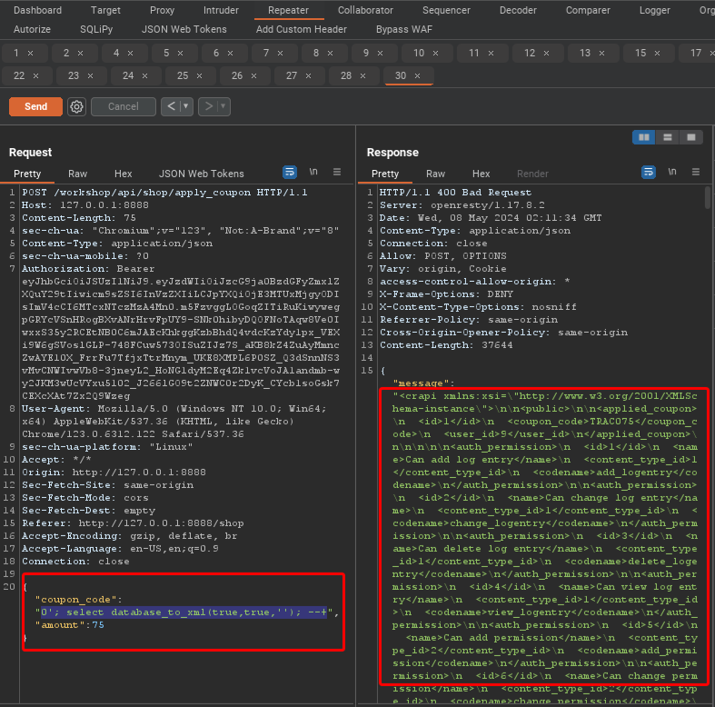
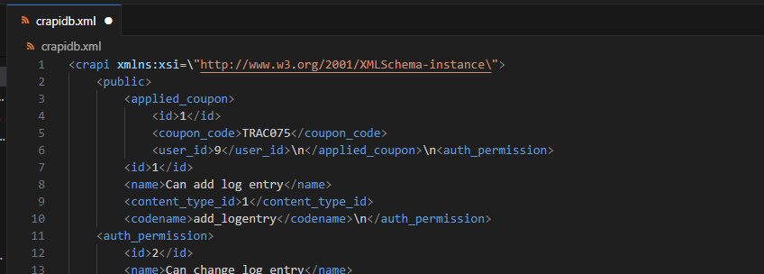

## Lesson 12 - Other2 SQL Injection

"A [SQL injection](https://owasp.org/www-community/attacks/SQL_Injection) attack consists of insertion or “injection” of a SQL query via the input data from the client to the application. A successful SQL injection exploit can read sensitive data from the database, modify database data (Insert/Update/Delete), execute administration operations on the database (such as shutdown the DBMS), recover the content of a given file present on the DBMS file system and in some cases issue commands to the operating system. SQL injection attacks are a type of injection attack, in which SQL commands are injected into data-plane input in order to affect the execution of predefined SQL commands."
[SQL Injection | OWASP Foundation](https://owasp.org/www-community/attacks/SQL_Injection)

SQL injections are designed to simply modify the SQL query that will be built by the application so that it returns the data you want. You might have SQL query that will find all records where a specific field is equal to the value a user puts into a field. For instance, we might submit the following in a field:

```
asdf' or 1 = 1'--#comment here
```

Which will make the query:

``` 
SELECT * from "Table" WHERE "Field" = asdf or 1 = 1'--#comment here
```

This query statement is basically saying retrieve everything where the field is 105 or where 1=1 (which is TRUE). Since 1 does equal 1 the statement is true and everything will retreived.

## Dump the SQL Database

We redeemed a coupon in the last lesson. If you attempted to redeem it a second time, you will note it told you that it was already redeemed. But what if we could trick the system into thinking it should apply the coupon again? In this lesson you will apply a standard SQL injection to trick the application into applying the coupon multiple times. In this particular case, typical SQL injections will not allow you to reuse the coupon. Instead you need to get the database schema so you can update or delete the table row that indicates your user has already applied the coupon. In our case, we will attempt to dump the entire database.

#### Lab Steps

1. Browse to the "Shop" menu to see products you can purchase. Take note of the amount of funds you have available.

2. Go to the Proxy HTTP History and look for the POST request URL /workshop/api/shop/apply_coupon

   

3. Right click on the request and send it to Repeater.

4. Switch over to Repeater. Change the "coupon_code" to "0'; select version() --+". This is a SQL command to display the version. Select the "Send" button and look at the response.

   

5. Note that the Workshop microservice is using PostgreSQL 14.11 on a Debian 14.11 server. This information is often used by attackers to determine if there are known vulnerabilities or specific SQL injections they might want to try.

6. Looking up PostgreSQL injections we find the following can be used to dump the database as an XML document, "0'; select database_to_xml(true,true,''); --+". Let's replace our injection and hit "Send" again.

   

7. If you copy and paste the results into Visual Studio and use an XML formmater, you will see the database results.

   

8. This is a worse case scenario. Any sensitive information like personally identifiable information (PII) or credentials are retrieved by the attacker.

9. Challenge completed.

