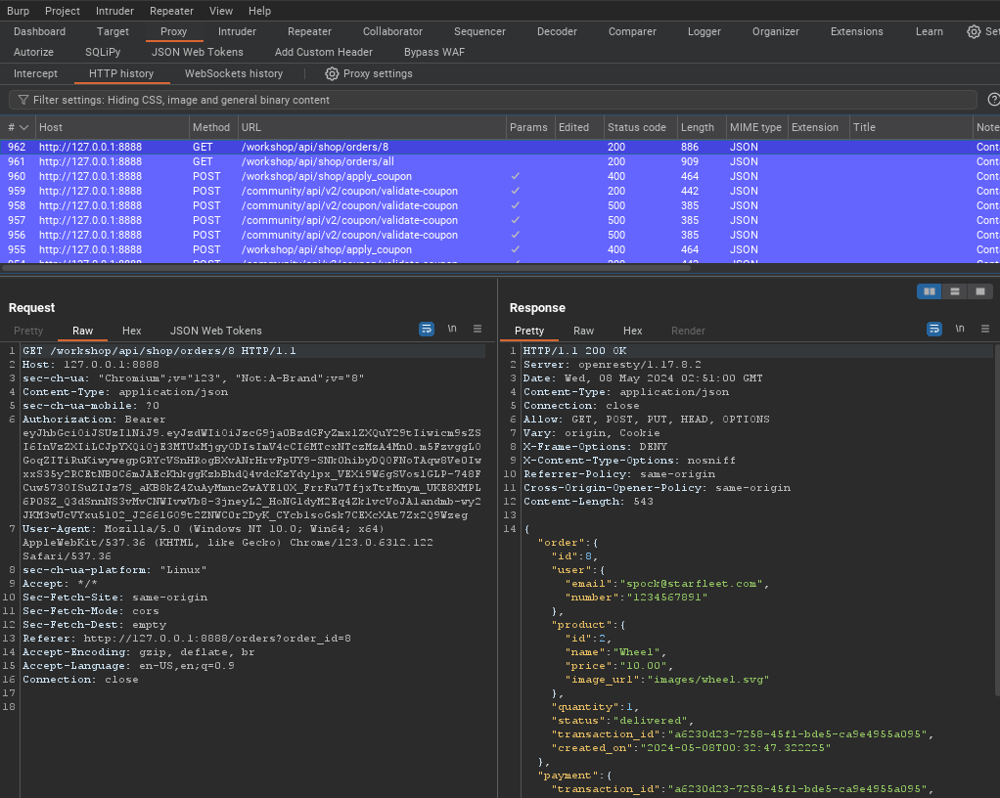
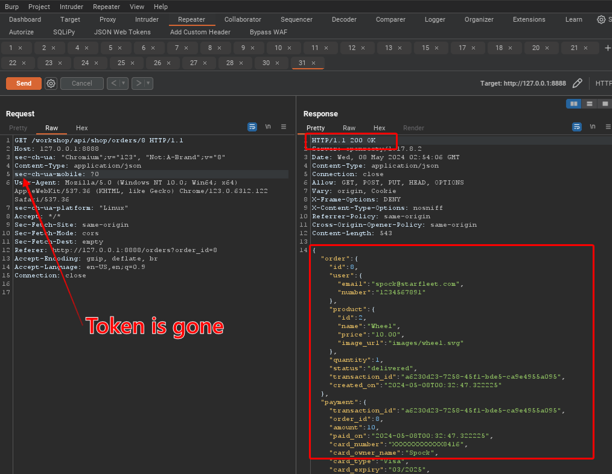

## Lesson 13 - Other3 Unauthenticated Access

"Access control enforces policy such that users cannot act outside of their intended permissions. Failures typically lead to unauthorized information disclosure, modification, or destruction of all data or performing a business function outside the user's limits."
[A01 Broken Access Control - OWASP Top 10:2021](https://owasp.org/Top10/A01_2021-Broken_Access_Control/)

Identity Access Management (IAM) deals with authentication and authorization. We have already looked at broken authentication where we could hijack someone elses account. We have also looked at broken authorization where we were authenticated as one user but able to access information or perform activities for another user without authorization. This vulnerability is a bit more specific and refers to the ability to view data or interact with data without any authentication or authorization. It is the a way of bypassing the IAM system.

## Anonymous access of order details

We have noted that for most of our requests, we have had to include a JWT token. crAPI uses the JWT tokens to track the user's activities. If we were to browse through the site but tell Burp Suit to automatically remove the JWT for each request, we might find a page that will respond without checking to see if we have authenticate or gained authorization.

#### Lab Steps

1. Browse to the "Shop" tab and then select "Past Orders" and "Order Details".

2. Go to the Proxy HTTP History window and look for the request URL /workshop/api/shop/orders/(some number)

   

3. Notice that the request has an "Authorization: Bearer" header that includes the JWT. Right-click on the request and send it to Repeater.

4. Go to the Repeater tab and then delete the Authorization line from the request and hit "Send".

   

5. In the response window you will see that the request was successful and the data was returned without knowing who sent the request. 

6. Challenge complete.
