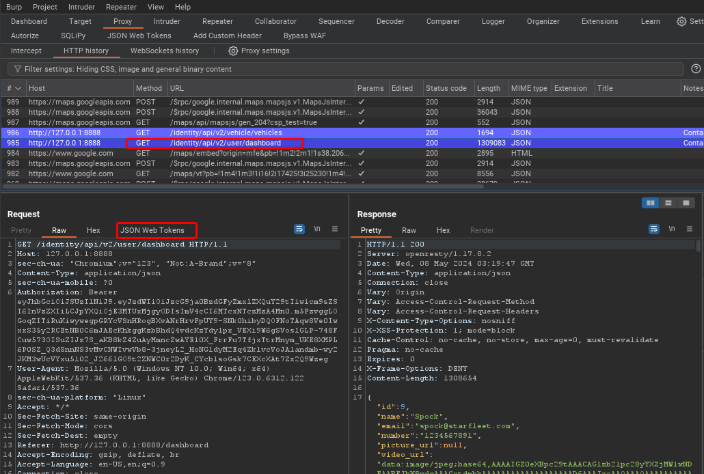
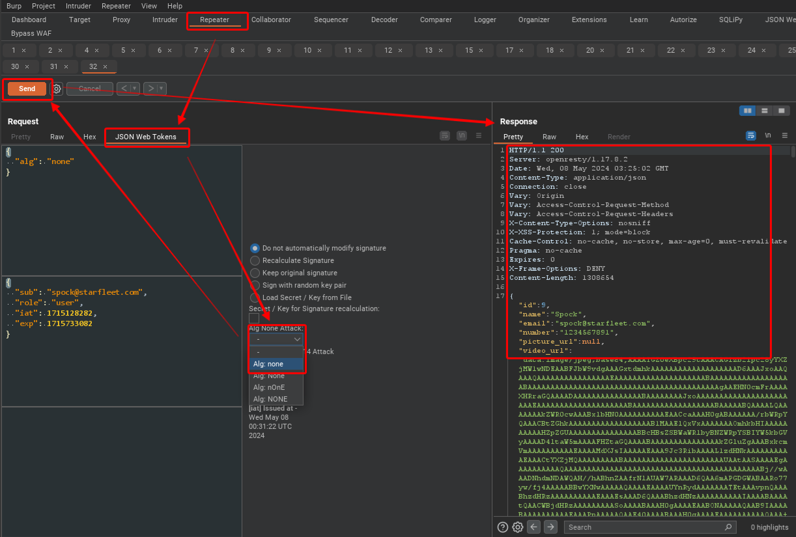
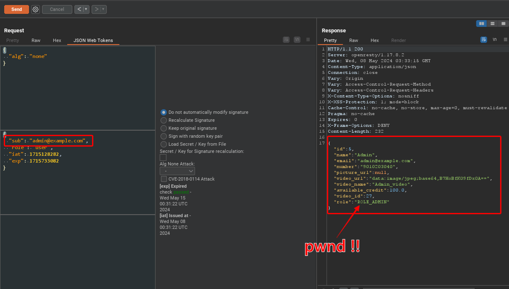
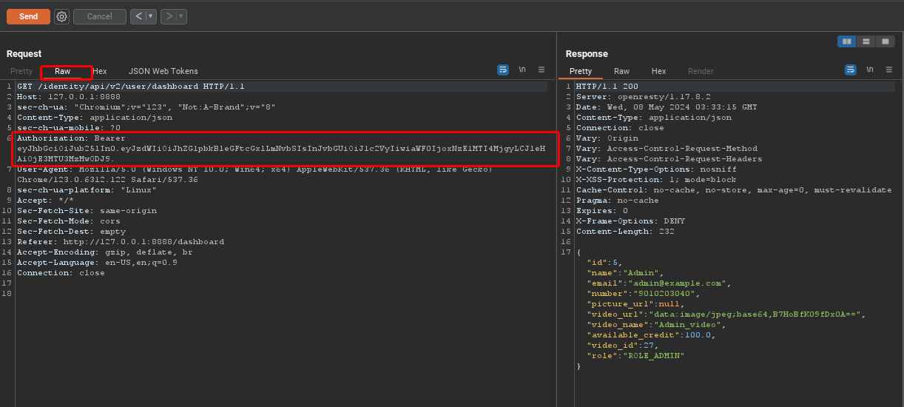

## Lesson 14 - Other4 JWTs

"JSON Web Token is used to carry information related to the identity and characteristics (claims) of a client. This information is signed by the server in order for it to detect whether it was tampered with after sending it to the client. This will prevent an attacker from changing the identity or any characteristics (for example, changing the role from simple user to admin or change the client login)."
[JSON Web Token for Java - OWASP Cheat Sheet Series](https://cheatsheetseries.owasp.org/cheatsheets/JSON_Web_Token_for_Java_Cheat_Sheet.html)

JWTs are all the rage in APIs. They are easy to use and are formatted in JSON making them easy for API developers to work with. But they can create a lot of problems if not handled properly. JWTs should have a clear purpose (tracking identity and authorization) and not be used for anything else. JWTs contain information about the signing algorithm, the token type, and then the payload. These should be planned for explicitly and the information when irrelevant, the information should be explicitly ignored. For instance, if you already know you will be using the HS256 signing algorithm, then you can ignore the setting in the JWT. This will prevent an attacker from setting it to NONE and bypassing signing. Keys should never be stored in browser memory or cache where they might be stolen by a XSS attack. Best practice is to use a cookie with the HttpOnly tag set. This ensures that the cookies is never sent in plaintext.

## Create a full access token

Our goal of this exercise is to craft our own token that provides full access to the application. This means that we want to be able to use a token that is intercepted and we need to gain admin level authorization. We will use another feature of Burp Suite, the JSON Web Token extension, to both view and edit our JWT. If a JWT is signed, then it will either use HMAC (symmetric hash) or RSA (asymmetric hash). A weak HMAC hash can be taken offline and possibly cracked. If it is cracked, then you can use the secret to sign your own tokens. Otherwise, any changes you make to the token will be rejected. However, since the JWT states what signing algorithm it is using, you could try setting it to none. If that works, then we can make changes and the system will accept them. (A securely configured API server will have the signing algorithm explicitly set and ignore the algorithm stated in the JWT. Luckily for us, crAPI is not securely configured!)

#### Lab Steps

1. Browse to the "Dashboard" tab and then review the associated request in the Proxy HTTP History window.

   

2. Right-click on the row and send it to Repeater and then click on the Repeater tab.

3. Next click on the "JSON Web Tokens" tab. Note that the JWT is then displayed in a user friendly JSON format. Now select "None" from the "Alg None Attack:" drop down box and then select "Send"

   

4. Notice that the command was successful and the signing box is now empty. This means that we can make changes to 

5. Now we can make additional changes to the JWT. Does anything stand out to you that you could change and possibly gain greater access?

6. The "role" parameter looks interesting. However, we also know from previous exploration that there is a user in the system who has had work done on their car and they had the email, admin@example.com. What would happen if we changed the "sub" parameter to that email?

    

7. Now if we switch back to "Raw" mode in the request window, we will see the new JWT that we can add to other activities and thus gain full access to the site.

   

8. Notice how much shorter the JWT is when it is not signed!

9. Challenge completed.
